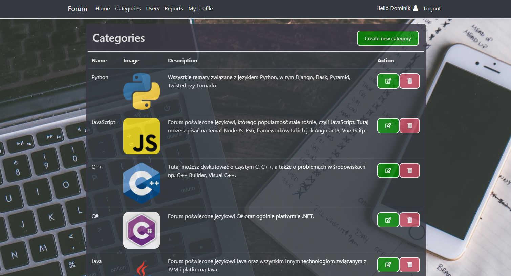

# ProgrammingForum
Application provides basic functions of a discussion forum.

## Tech stack:
- ASP.NET Core MVC
- Entity Framework Core 3.1
- MS SQL Server
- Bootstrap

## Screenshots:

  
  
  
  
  

